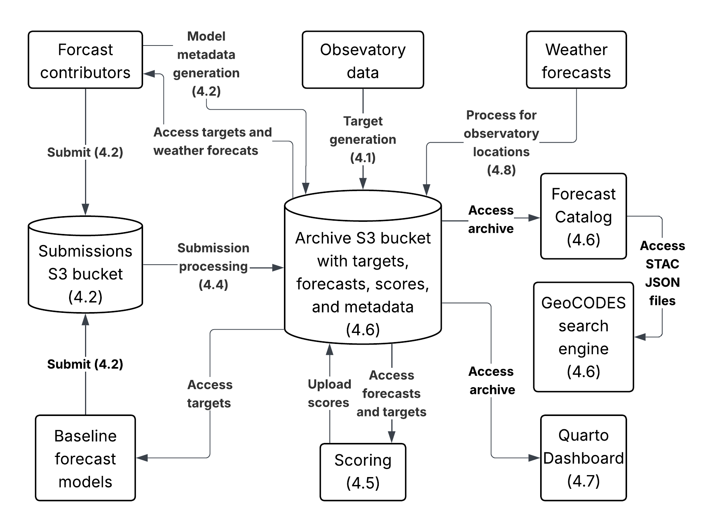

## National Ecological Observatory Network (NEON) Ecological Forecasting Challenge Cyberinfrastructure

Thomas, R.Q. and C. Boettiger. (2025). Cyberinfrastructure to Support Ecological Forecasting Challenges. ESS Open Archive. http://doi.org/10.22541/essoar.175917344.44115142/v1

# 

The following elements of a forecasting challenge workflow are included in this repo. GitHub Actions are used to automate tasks.

1)  Generation of targets
2)  Processing of submissions
3)  Generation of baseline forecasts
4)  Evaluation (scoring) of submitted forecasts
5)  Generation of Quarto dashboard
6)  Generation of STAC catalog
7)  Download of weather drivers for forecasts
8)  Creation of Docker containers with supporting software

See <[https://doi.org/10.1002/fee.2616](http://doi.org/10.22541/essoar.175917344.44115142/v1)> for more information on the structure of a forecasting challenge.

Supported by the U.S. National Science Foundation grants (DEB-1926388, OAC-2209866, DEB-2327030, and OAC-2311124)
